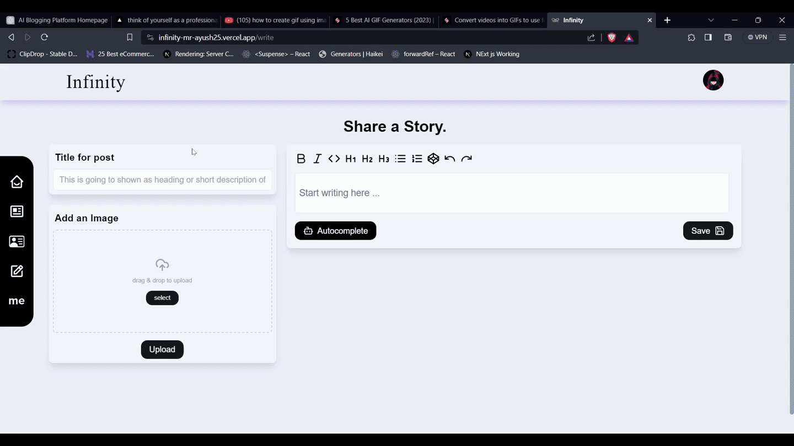

# Infinity Blog Application

## Table of Contents

- [Introduction](#introduction)
- [Preview](#preview)
- [Features](#features)
- [Technologies](#technologies)
- [Installation](#installation)
- [Usage](#usage)
- [Authentication](#authentication)
- [Contributing](#contributing)
- [License](#license)

## Introduction

Welcome to the Infinity Blog Application, a real-time interactive web platform dedicated to tech enthusiasts and programmers. This application allows users to explore, write, and share blogs on topics related to the tech space and programming. It's designed to provide a seamless CRUD (Create, Read, Update, Delete) experience for tech bloggers. And write blog using auto-completion feature and user can comment and share their throught with people.

## Preview



## Features

- **Home:** Explore the latest tech blogs and stay updated with the ever-evolving tech world.
- **Blog:** Browse a diverse range of blogs on various tech topics.
- **User's Personal Blog:** Create and manage your own tech blog and showcase your expertise.
- **Blog Writing Section:** Write and publish tech blogs using an advanced TipTap editor integrated with OpenAI GPT-3.5 Turbo for auto-completion.
- **About:** Learn more about the application and its creators.

## 👨‍💻Technologies

This application is built using a modern tech stack:

- [Next.js](https://nextjs.org/docs) for server-side rendering and routing.
- [React Hooks](https://reactjs.org/docs/hooks-intro.html) for building functional components.
- [JavaScript](https://developer.mozilla.org/en-US/docs/Web/JavaScript) for programming.
- [useSWR](https://swr.vercel.app/) for efficient data fetching.
- [NextAuth](https://next-auth.js.org/) for secure authentication.
- [Tailwind CSS](https://tailwindcss.com/) for a responsive and elegant user interface.
- [MongoDB](https://www.mongodb.com/) for real-time interactive database functionality.
- [EdgeStore](https://edgestore.dev/) for image storage.
- [OpenAI GPT-3.5 Turbo](https://openai.com/) for AI-powered blog content generation.

## Installation

1. Clone this repository:
   ```bash
   git clone https://github.com/Sanjeev2514/Infinity.git
   cd infinity
   ```

## Usage

1. Visit the application's URL in your browser.
2. Securely log in using NextAuth.
3. Explore tech blogs, write your own, and enjoy the community.

## 🔐Authentication

The Tech Blog Application uses NextAuth for authentication. This ensures a secure and streamlined login experience for users. You can create an account or log in using various providers, making the process convenient and user-friendly.

## Contributing

Contributions are welcome! Please follow our Contribution Guidelines.

## License

This project is licensed under the MIT License.

## Deployed on Vercel

The easiest way to deploy your Next.js app is to use the [Vercel Platform](https://vercel.com/new?utm_medium=default-template&filter=next.js&utm_source=create-next-app&utm_campaign=create-next-app-readme) from the creators of Next.js.

Check out our [Next.js deployment documentation](https://nextjs.org/docs/deployment) for more details.
